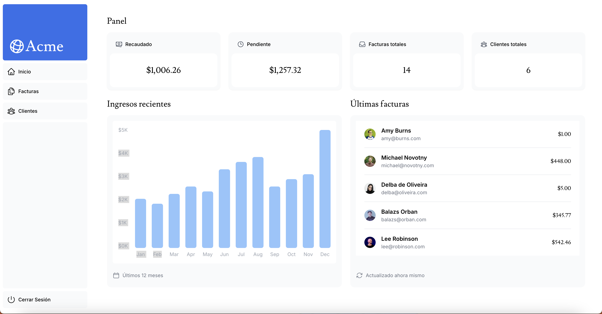

# 📊 Next.js Panel

Este es un panel financiero desarrollado con **Next.js** y **TypeScript**, que utiliza el sistema de rutas **App Router**. Es una plantilla básica para aplicaciones de panel de administración, creada como punto de partida para el **Next.js App Router Course**.

**Demo en Vivo:**  
🔗 [Vista Previa del Panel](https://nextjs-invoice-panel.vercel.app)

---

## 🖼️ Vista Previa



## 🚀 Tecnologías Utilizadas

- [Next.js](https://nextjs.org/) con App Router
- [TypeScript](https://www.typescriptlang.org/)
- [Tailwind CSS](https://tailwindcss.com/)
- [pnpm](https://pnpm.io/) como gestor de paquetes

---

## 📁 Estructura del Proyecto
```bash
nextjs-panel/
│
├── app/              # Rutas y páginas principales
├── public/           # Archivos públicos (imágenes, íconos, etc.)
├── next.config.ts    # Configuración de Next.js
├── package.json       # Dependencias y scripts
└── tailwind.config.ts # Configuración de Tailwind
```

---

## 📦 Instalación

Sigue estos pasos para clonar y ejecutar el proyecto localmente:

1. **Clona el repositorio:**

```bash
git clone https://github.com/josep100/nextjs-panel.git
 ```

2. **Accede al directorio del proyecto:**
```bash
cd nextjs-panel
```
3. **Instala las dependencias con pnpm (recomendado):**
```bash
pnpm install
```
También puedes usar npm o yarn:
```bash
npm install
# o
yarn install
```
# 🧪 Modo Desarrollo

1.	**Inicia el servidor de desarrollo:**
```bash
pnpm dev
```
2. **Abre tu navegador en:**
```bash
http://localhost:3000
```

  


   
